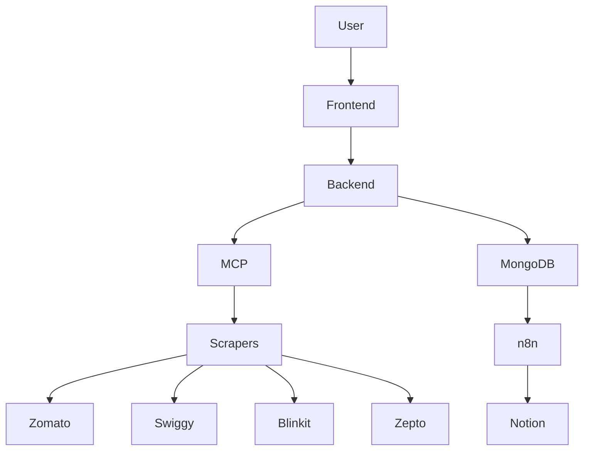

# Architecture

## Data Flow

1. User submits an item + location from the frontend.
2. Backend calls MCP `/compare`, which fans out to the four Playwright scrapers.
3. MCP aggregates normalized platform payloads and responds.
4. Backend computes recommendation, caches response, and persists to MongoDB.
5. n8n workflows consume backend or MCP hooks to refresh data, persist to Notion, and send alerts.
